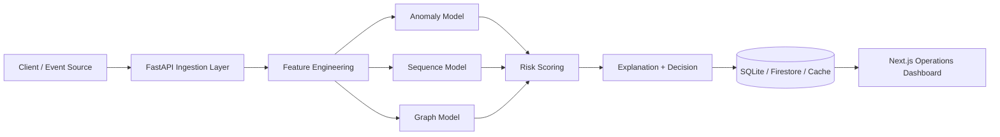

# Traceveil

<div align="center">
  <p><strong>Real-time fraud and abuse detection platform</strong></p>
  <p>FastAPI backend + Next.js control center + multi-model risk engine</p>

  <p>
    
    
    
    
    
  </p>
</div>

## Platform Snapshot

| Layer | What it does | Tech |
|---|---|---|
| Ingestion API | Accepts events and user signals in real time | FastAPI, Pydantic |
| Risk Engine | Aggregates anomaly, sequence, and graph intelligence | PyTorch, scikit-learn, NetworkX |
| Explainability | Generates human-readable risk explanations | Custom explanation module |
| Web Console | Operational dashboards for analytics, models, entities, and docs | Next.js, TypeScript, Tailwind |

## Architecture



## Quick Start

### Option A: One-command startup (recommended)

Windows:
```bash
start.bat
```

macOS/Linux:
```bash
./start.sh
```

### Option B: Manual startup

Backend:
```bash
pip install -r requirements.txt
python -m uvicorn app.main:app --host 127.0.0.1 --port 8000 --reload
```

Web app:
```bash
cd webapp
npm install
npm run dev
```

Open:
- Web UI: `http://localhost:3000`
- API: `http://localhost:8000`
- OpenAPI docs: `http://localhost:8000/docs`

## API Endpoints

| Method | Endpoint | Purpose |
|---|---|---|
| `GET` | `/` | API health message |
| `POST` | `/events/submit` | Submit event and get risk assessment |
| `GET` | `/user/{user_id}/risk` | Get user risk profile |
| `POST` | `/feedback` | Submit analyst feedback |
| `GET` | `/feedback/stats` | Feedback loop stats |
| `GET` | `/models/status` | Model versions and current registry |
| `GET` | `/events/recent` | Recent high-risk entities/events |
| `GET` | `/dashboard/metrics` | Dashboard metrics snapshot |
| `GET` | `/dashboard/models` | Dashboard model list |

## Frontend Capabilities

- Premium dashboard experience with dark/light themes
- Model intelligence strip and real-time KPI cards
- Event ingestion flow with AI explanation output
- Entity/user risk exploration surfaces
- Docs section with architecture and API references

## Project Structure

```text
Traceveil/
  app/                    # FastAPI application, routes, models, scoring
  data/                   # Data generation and supporting datasets/scripts
  tests/                  # Python tests
  webapp/                 # Next.js application
  start.bat               # Windows startup script
  start.sh                # macOS/Linux startup script
  requirements.txt
```

## Configuration

### Backend

Environment variables:

| Variable | Default | Description |
|---|---|---|
| `CORS_ALLOWED_ORIGINS` | local defaults | Comma-separated allowed origins |

### Frontend (`webapp/.env.local`)

| Variable | Example | Description |
|---|---|---|
| `NEXT_PUBLIC_API_URL` | `http://localhost:8000` | Backend API base URL |

## Troubleshooting

### Torch DLL error on Windows (`WinError 1114`)

If `torch` fails to load (for example `c10.dll`), verify:
1. You are using a supported Python version and architecture.
2. Visual C++ Redistributable is installed.
3. Your Torch build matches your environment (CPU/GPU).

Then reinstall Torch in your active environment and restart the backend process.

## Documentation for Contributors

- Contribution guide: [CONTRIBUTING.md](CONTRIBUTING.md)
- License: [LICENSE](LICENSE)

